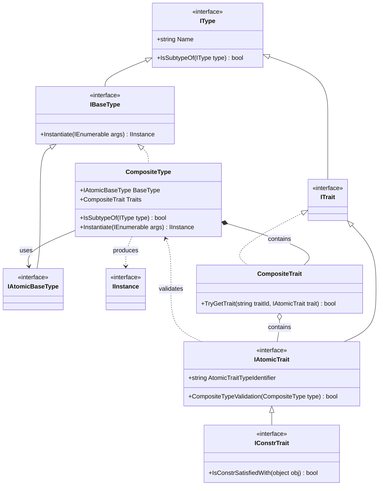

# Class Diagram for TypesCore.cs (CompositeType context)

```mermaid
classDiagram
    class IType {
        <<interface>>
        +string Name
        +IsSubtypeOf(IType type) bool
    }

    class IBaseType {
        <<interface>>
        +Instantiate(IEnumerable args) IInstance
    }

    class IAtomicBaseType {
        <<interface>>
    }

    class ITrait {
        <<interface>>
    }

    class IAtomicTrait {
        <<interface>>
        +string AtomicTraitTypeIdentifier
        +CompositeTypeValidation(CompositeType type) bool
    }

    class IConstrTrait {
        <<interface>>
        +IsConstrSatisfiedWith(object obj) bool
    }

    class IInstance {
        <<interface>>
    }

    IType <|-- IBaseType
    IType <|-- ITrait
    IBaseType <|-- IAtomicBaseType
    ITrait <|-- IAtomicTrait
    IAtomicTrait <|-- IConstrTrait

    class CompositeType {
        +IAtomicBaseType BaseType
        +CompositeTrait Traits
        +IsSubtypeOf(IType type) bool
        +Instantiate(IEnumerable args) IInstance
    }
    IBaseType <|.. CompositeType
    CompositeType --> IAtomicBaseType : uses
    CompositeType *-- CompositeTrait : contains

    class CompositeTrait {
        +TryGetTrait(string traitId, IAtomicTrait trait) bool
    }
    ITrait <|.. CompositeTrait
    CompositeTrait o-- IAtomicTrait : contains
    
    CompositeType ..> IInstance : produces
    IAtomicTrait ..> CompositeType : validates
```
